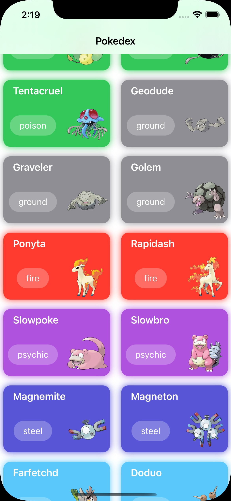

# Pokedex

 

 

  

## 💻 Projeto

Pokedex feito com SwiftUI

## :memo: Licença

Esse projeto está sob a licença MIT. Veja o arquivo [LICENSE](LICENSE.md) para mais detalhes.

---

Feito com ♥ by morikawa77
